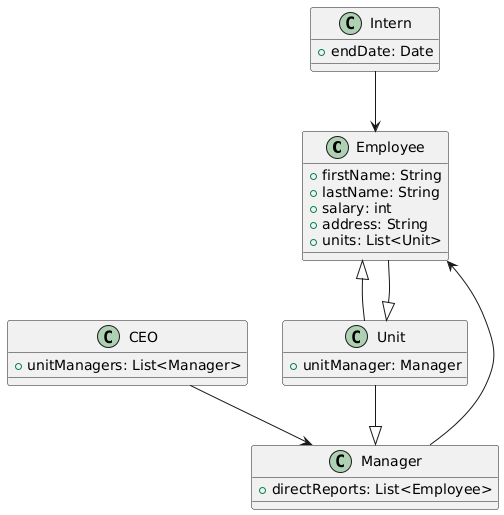

# CSCI 2113 - J2 
1. Which of the following is an object and which is a basic type?
    ```java
    int a;
    double b;
    int c[] = {1, 2, 3};
    String s = "Hello World";
    ```
    > String is a object and int is a basic type 
2. Two part question:
    * What is a static method in Java?
        * A static method is any method that does not need an existing object, rather it can be called on the class itself. 
    * Why does the main method need to be a static method?
        * The main method gets called by other classes, which requires it to be static
    ```java
    public class Hello {
        public static void main(String[] args) {
            System.out.println("hello, world");
        }
    }
        ```
3. What is the output of the following programs?
    ```java
    /* Program 1 */
    public static void main(final String args[]) {
        String choice = new String("A");
        if (choice == "A") {
            System.out.println("Correct");
        }
        else {
            System.out.println("Wrong");
        }
    }
    ```
    > Print "Wrong" as it tries to compare memory addresses
    ```java
    /* Program 2 */
    public static void main(final String args[]) {
        String choice = new String("A");
        if (choice.equals("A")) {
            System.out.println("Correct");
        }
        else {
            System.out.println("Wrong");
        }
    }
    ```
    > Print "Correct" as it actually compares the content of the String
4. Does the below program change the season? Why, or why not?
    ```java
    static void change_season(String str) {
        str = "Spring";
    }

    public static void main(final String args[]) {
        String season = "Winter";
        change_season(season);
        System.out.println("The current season is: " + season);
    }
    ```
    > No, when calling `change_season(season)`, it passes a copy of season into the function `change_season`. Changing the value of the string only affects the local copy, not the variable `season`.
5. What is the output of the main method below? Please explain.
    ```java
    public class Point {
        double x = 0;
        double y = 0;

        public Point(double x, double y) {
            x = x;
            y = y;
        }
    }
    
    public static void main(final String args[]) {
        Point point = new Point(1, 2);
        System.out.println("X: " + point.x + " Y: " + point.y);
    }
    ```
    > It prints X: 0, Y: 0 as there is an issue with the constructor which does only changes the local copy of the variable on the stack, rather than on the heap. By adding `this.x = x` and `this.y = y` fixes the issue.
6. What principle of OOP does the `private` declaration for variable and functions achieve? Explain.
    * The `private` declaration maintains the principle of information hiding or encapsulation, where other classes outside of the `private` class or variable is unable to modify the information.
7. In the `Point` class below, how does Java choose between the two constructors.
    ```java
    public class Point {
        
       private double x, y; 
   
       public Point(double x, double y) {
            this.x = x;
            this.y = y;
       }

       public Point(Point other) {
           this.x = other.getX();
           this.y = other.getY();
       }
    }
    ```
    > It chooses based on the number of arguments, and uses that constructor.
8. For the below questions, when the class `Point` is referenced, we are talking about the below class, which you can assume is fully implemented and working as described:
    ```java
    public class Point {
       private double x,y; //the x,y fields
       public Point(double x,double y); //construct a point from an x,y
       public Point(Point other); //construct a point from another point
       public double getX(); //return the x component
       public double getY(); //return the y component
       public double setXY(double x, double y); //sets the x and y fields
       public String toString(); //return the string representation
       private double sum_x_y(); // Returns the sum of X and Y
    }
    ```
    Say we want to make a class that extends `Point` with a method that can reflect a point across the X and Y axis:
    ```java
    public class CustomPoint extends Point {
        public void reflect(); // Reflects point
    }
    ```
    Which of the following implementations achieves this?
    ```java
        // Option 1
    public void reflect() {
        x = -x;
        y = -y;
    }

    // Option 2
    public void reflect() {
        this.x = -this.x;
        this.y = -this.y;
    }

    // Option 3
    public void reflect() {
        this = Point(-x,-y);
    }
    
    // Option 4
    public void reflect() {
        double x = -this.getX();
        double y = -this.getY();
        this.setXY(x,y);
    }
    
    // Option 5
    public void reflect() {
        x = -this.getX();
        y = -this.getY();
    }
    ```
    > Option 4, as the variables X, Y are private. This means we need to use getters and setters to modify and use the values of those variables. To reflect, that means creating two new variables, using get[X,Y] to grab the values of the existing point and modifying it, then changing the values by using setXY. 
9. If we add this constructor to `CustomPoint`:
    ```java   
    public CustomPoint() {
        setXY(10, 10); // Line 1
        super(0, 0); // Line 2
    }
    ```
    ```java
    public static void main(final String args[]) {
        CustomPoint p = new CustomPoint();
        System.out.println(p.toString());
    }
    ```
    > The code does not compile. `super` has to be the very first line otherwise the compile will not compile the code. 
10. What if we switch line 1 and 2 in the previous question?
    * Then, the point would initialize at \(0,0), and then `setXY` will change the values to be \(10,10).
11. If we want to override `sum_x_y` in our custom point, but first reflect the point before returning the sum, which of the following implementations are valid? \(Note: assume that `reflect` has a valid implementation)
    ```java
    //Option 1
    public double sum_x_y() {
        this.reflect()
        return super.sum_x_y();
    }

    //Option 2
    public double sum_x_y() {
        this.reflect();
        return this.getX() + this.getY();
    }

    //Option 3
    public double custom_sum_x_y() {
        this.reflect()
        return super.sum_x_y();
    }

    //Option 4
    public double custom_sum_x_y() {
        this.reflect();
        return this.getX() + this.getY();
    }
    ```
    > Option 2 works, as it overrides the existing `sum_x_y`, and for option 2 manually does `sum_x_y` with the same reflect as option 1. 
12. What is the point of the `protected` modifier? Why do we have it and how does it work in terms of inheritance?
    * Protected is a extension of the `private` modifier that allows subclasses to access the information rather than no other class being able to access it. 
13. Consider the following class
    ```java 
    public class Racecar {
        private int number; 
        private Driver driver; //assume implemented properly
        protected String sponsor = null;
        public Racecar(int n, Driver d) {
            number = n;
            driver = d;
        }

        public String toString() {
            return "Car #" + number + " Driver: " + driver;
        }
    
        protected addSponsor(String sp) {
            sponsor = sp;
        }
    }
    ```
    Suppose we want to extend this to a `FormulaOne` class which has a make, e.g., Mercedes. Complete the constructor and `toString()` method. 
    ```java 
    public class FormulaOne extends Racecar {
        private String make;

        public FormulaOne(int n, Driver d, String make) {
            super(n, d);
            this.make = make; 
        }
        
        public String toString() {
            return super.toString() + " Make: " + make;9
        }
    }
    ```
14. Using the `Racecar` and `FormulaOne` classes above, if we had a main method **in a different class than either of those**,
    ```java
    public static void main(String args[]) {
       Racecar r = new Racecar(/* ... some args .. */);
       r.addSponsor("Home Depot"); //<--A

       FormulaOne f1 = new FormulaOne(/* ... some args .. */);
       f1.addSponsor("Home Depot"); //<--B
    }
    ```
    > No, first since `FormulaOne` does not override the existing `addSponsor`, both A and B must either work or not work. Since `addSponsor` is protected, the main class is in a different class than either `Racecar` or `FormulaOne`, which is unable to access protected modified functions and variables. 
15. Consider the UML diagram from the notes. Expand this to include an **intern**. An **intern** is like an employee, has a manager, unit, but has an expiration on their employment. How does this fit into the UML diagram? Include your UML diagram and explanation below in this markdown file.
    > 
    
